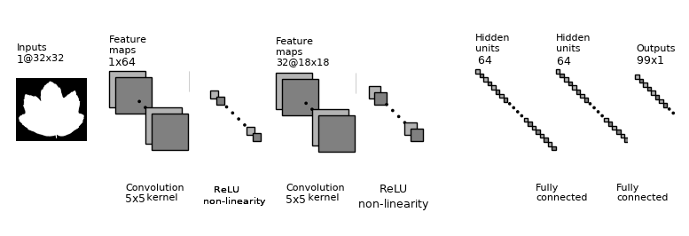
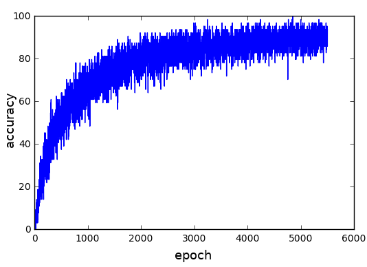
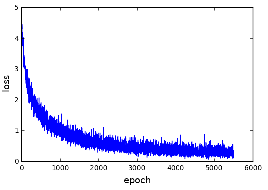
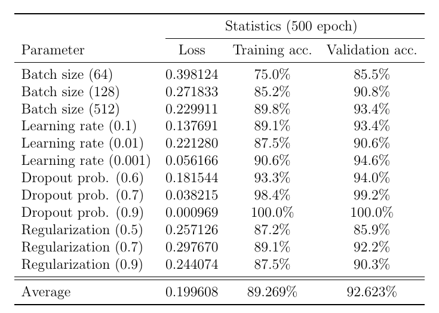

# Leaf Classification

The goal of this project is to automate the process of plant recognition using a leaf image as an input. The input to the system is an image of a leaf and the output is the name of the plant species to which it belongs. There are millions of plant species around the globe, therefore, this is not an easy task. Many medical fields which involve plants in creating medicines can find an extensive use of this classifier. It can also be a simple smart-phone application where the user will take a picture of a plant leaf and instantly know the name of the species it belongs to.

## Model Architecture

The presented system uses a convolutional neural network (ConvNet) which is four layers deep for learning the leaf features. Each layer has 64 neurons. The training and test data are split into 80/20 batches. The reason for choosing the ConvNet architecture is due to the nature of the training data, as it requires analyzing visual imagery. This kind of architecture also requires relatively little pre-processing, thus saving computation cost. Its fully connected natures helps it to retain the learned information for longer periods of time. The model diagram is shown below.

<figure style="text-align:center;" class="image">
  
</figure>

## Dataset Used

The dataset for this problem contains around 1500 binary images. Apart from this, some feature details are also provided along with the image e.g. texture and shape, for which a separate attribute vector is given for each image individually. The original dataset is hosted on the University of California (UCL)'s website (https://archive.ics.uci.edu/ml/datasets/leaf). There are a total of 99 plant species to which a leaf can belong to and there are around 15 samples taken from each species. This allows us to train the model efficiently.

## Benchmarks

All the training data images have been converted to their binary representation. This reduces the overall computation cost, as the computation is only performed on a single dimension. The input images are also rescaled to a constant 32x32 size. Labels for the training data are stored in a separated CSV file. The training is done for 5500 steps which takes around 20 minutes on an Nvidia Tesla K80 machine. The training accuracy and loss are shown in the figure below.

<figure style="text-align:center;" class="image">
  
</figure>

<figure style="text-align:center;" class="image">
  
</figure>

Several experiments were performed in which learning rate, dropout probability, regularization strength, and batch size were tweaked. The effect of this on training and validation accuracy is shown in the figure below.

<figure style="text-align:center;" class="image">
  
</figure>

# Getting Started

These instructions will get you a copy of the project up and running on your local machine for development and testing purposes.

### Prerequisites

This software has the following requirements:

* Python 2.7 or later!
* `NumPy` 1.11 or later
* `TensorFlow`
* `Matplotlib`
  
### Installation

```
git clone https://github.com/adl1995/leaf-classification.git
cd leaf-classification
pip install -r requirements.txt
python learn.py
```

## License

This project is not under any license.

